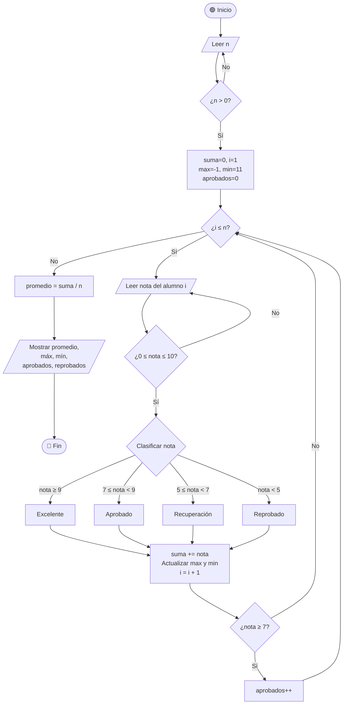

# 🖥️ Ejercicio con estructura condicional y repetitiva


 
**Este ejercicio demuestra el uso de estructuras condicionales y repetitivas en pseudocódigo y diagramas de flujo.**
---
# 📊 Ejercicio: Clasificador de Notas con Estadísticas

> **Materia:** Fundamentos de Programación  
> **Lenguaje:** C  
> **Estructuras aplicadas:** Condicional (`if / else if / else`) + Repetitiva (`while` + `for`)

---

## 1. 📋 Planteamiento del problema

Una institución educativa necesita un programa que procese las notas de un grupo de alumnos al final del semestre. El programa debe:

1. Pedir al usuario cuántos alumnos tiene el grupo (`n`).
2. Leer la nota de cada alumno (valor entre **0 y 10**).
3. **Clasificar** cada nota en una categoría:
   - `Excelente`  → nota ≥ 9
   - `Aprobado`   → nota ≥ 7 y < 9
   - `Recuperación` → nota ≥ 5 y < 7
   - `Reprobado`  → nota < 5
4. Al finalizar, mostrar:
   - El **promedio** del grupo
   - La nota **máxima** y la nota **mínima**
   - La cantidad de alumnos **aprobados** (nota ≥ 7) y **reprobados** (nota < 7)

**Restricciones:**
- `n` debe ser mayor que 0 (se valida con un bucle).
- Cada nota debe estar entre 0 y 10 inclusive (se valida con un bucle).

---

## 2. 🔍 Análisis del problema

### Entradas

| Variable | Tipo | Descripción |
|---|---|---|
| `n` | Entero | Cantidad de alumnos del grupo |
| `nota` | Real (float) | Calificación de cada alumno (0.0 – 10.0) |

### Salidas

| Variable | Tipo | Descripción |
|---|---|---|
| `promedio` | Real | Suma de notas / n |
| `max` | Real | Nota más alta del grupo |
| `min` | Real | Nota más baja del grupo |
| `aprobados` | Entero | Alumnos con nota ≥ 7 |
| `reprobados` | Entero | Alumnos con nota < 7 |
| Clasificación | Texto | Categoría de cada nota individual |

### Variables auxiliares

| Variable | Tipo | Descripción |
|---|---|---|
| `suma` | Real | Acumulador de notas para calcular el promedio |
| `i` | Entero | Contador del bucle (1 hasta n) |

### Proceso (descripción textual)

1. Validar que `n > 0` (bucle `while`).
2. Inicializar `suma = 0`, `max = -1`, `min = 11`, `aprobados = 0`.
3. Para cada alumno `i` de 1 a `n` (bucle `for`):
   a. Leer `nota`, validando que esté entre 0 y 10 (bucle `while` interno).
   b. Clasificar la nota con estructura `if / else if / else`.
   c. Acumular: `suma += nota`, actualizar `max` y `min`, contar aprobados.
4. Calcular `promedio = suma / n`.
5. Mostrar resultados generales.

---

## 3. 📐 Diseño del algoritmo

### Diagrama de flujo



### Pseudocódigo

```
Inicio
    Hacer
        Escribir "¿Cuántos alumnos tiene el grupo?"
        Leer n
    Mientras (n <= 0)

    suma    ← 0
    max     ← -1
    min     ← 11
    aprobados ← 0

    Para i ← 1 Hasta n Con paso 1 Hacer

        Hacer
            Escribir "Ingrese nota del alumno ", i, " (0 a 10):"
            Leer nota
        Mientras (nota < 0 O nota > 10)

        Si (nota >= 9) entonces
            Escribir "Categoría: Excelente"
        Sino Si (nota >= 7) entonces
            Escribir "Categoría: Aprobado"
        Sino Si (nota >= 5) entonces
            Escribir "Categoría: Recuperación"
        Sino
            Escribir "Categoría: Reprobado"
        Fin_Si

        suma ← suma + nota

        Si (nota > max) entonces
            max ← nota
        Fin_Si

        Si (nota < min) entonces
            min ← nota
        Fin_Si

        Si (nota >= 7) entonces
            aprobados ← aprobados + 1
        Fin_Si

    Fin_Para

    promedio  ← suma / n
    reprobados ← n - aprobados

    Escribir "--- Estadísticas del grupo ---"
    Escribir "Promedio  : ", promedio
    Escribir "Nota máxima: ", max
    Escribir "Nota mínima: ", min
    Escribir "Aprobados : ", aprobados
    Escribir "Reprobados: ", reprobados
Fin
```

---

## 4. 💻 Codificación — Código fuente en C

```c
#include <stdio.h>

int main() {
    int   n, i, aprobados = 0, reprobados;
    float nota, suma = 0.0f, promedio, max = -1.0f, min = 11.0f;

    /* ── Validar cantidad de alumnos ── */
    do {
        printf("Cuantos alumnos tiene el grupo? ");
        scanf("%d", &n);
        if (n <= 0)
            printf("  Error: ingrese un numero mayor que 0.\n");
    } while (n <= 0);

    printf("\n");

    /* ── Procesar cada alumno ── */
    for (i = 1; i <= n; i++) {

        /* Validar rango de la nota */
        do {
            printf("Alumno %d  ingrese su nota (0 a 10): ", i);
            scanf("%f", &nota);
            if (nota < 0 || nota > 10)
                printf("  Error: la nota debe estar entre 0 y 10.\n");
        } while (nota < 0 || nota > 10);

        /* Clasificar nota con condicional */
        if (nota >= 9)
            printf("  Categoria: Excelente\n");
        else if (nota >= 7)
            printf("  Categoria: Aprobado\n");
        else if (nota >= 5)
            printf("  Categoria: Recuperacion\n");
        else
            printf("  Categoria: Reprobado\n");

        /* Acumular suma */
        suma += nota;

        /* Actualizar maximo y minimo */
        if (nota > max) max = nota;
        if (nota < min) min = nota;

        /* Contar aprobados */
        if (nota >= 7)
            aprobados++;

        printf("\n");
    }

    /* ── Calcular y mostrar estadísticas ── */
    promedio   = suma / n;
    reprobados = n - aprobados;

    printf("========================================\n");
    printf("       ESTADISTICAS DEL GRUPO\n");
    printf("========================================\n");
    printf("  Promedio del grupo : %.2f\n", promedio);
    printf("  Nota mas alta      : %.2f\n", max);
    printf("  Nota mas baja      : %.2f\n", min);
    printf("  Alumnos aprobados  : %d\n",   aprobados);
    printf("  Alumnos reprobados : %d\n",   reprobados);
    printf("========================================\n");

    return 0;
}
```

---

## 5. ✅ Validación — Prueba de escritorio

### Datos de entrada para la prueba

| Alumno | Nota ingresada |
|---|---|
| 1 | 9.5 |
| 2 | 7.0 |
| 3 | 4.8 |
| 4 | 6.0 |
| 5 | 8.3 |

**n = 5**

### Traza del bucle principal

| i | nota | Categoría | suma | max | min | aprobados |
|---|---|---|---|---|---|---|
| 1 | 9.5 | Excelente | 9.50 | 9.5 | 9.5 | 1 |
| 2 | 7.0 | Aprobado | 16.50 | 9.5 | 7.0 | 2 |
| 3 | 4.8 | Reprobado | 21.30 | 9.5 | 4.8 | 2 |
| 4 | 6.0 | Recuperación | 27.30 | 9.5 | 4.8 | 2 |
| 5 | 8.3 | Aprobado | 35.60 | 9.5 | 4.8 | 3 |

### Cálculos finales

```
promedio   = 35.60 / 5  = 7.12
max        = 9.5
min        = 4.8
aprobados  = 3
reprobados = 5 - 3 = 2
```

### Salida esperada en consola

```
¿Cuántos alumnos tiene el grupo? 5

Alumno 1 — ingrese su nota (0 a 10): 9.5
  Categoría: Excelente

Alumno 2 — ingrese su nota (0 a 10): 7.0
  Categoría: Aprobado

Alumno 3 — ingrese su nota (0 a 10): 4.8
  Categoría: Reprobado

Alumno 4 — ingrese su nota (0 a 10): 6.0
  Categoría: Recuperación

Alumno 5 — ingrese su nota (0 a 10): 8.3
  Categoría: Aprobado

========================================
       ESTADÍSTICAS DEL GRUPO
========================================
  Promedio del grupo : 7.12
  Nota más alta      : 9.50
  Nota más baja      : 4.80
  Alumnos aprobados  : 3
  Alumnos reprobados : 2
========================================
```

### Prueba de validación de entradas (caso de error)

```
¿Cuántos alumnos tiene el grupo? -3
  Error: ingrese un número mayor que 0.
¿Cuántos alumnos tiene el grupo? 0
  Error: ingrese un número mayor que 0.
¿Cuántos alumnos tiene el grupo? 2

Alumno 1 — ingrese su nota (0 a 10): 15
  Error: la nota debe estar entre 0 y 10.
Alumno 1 — ingrese su nota (0 a 10): -1
  Error: la nota debe estar entre 0 y 10.
Alumno 1 — ingrese su nota (0 a 10): 8.0
  Categoría: Aprobado
```

---

## 6. 🧠 Principales dificultades y reflexión crítica

### Dificultades encontradas

**1. Elegir entre `while` y `do-while` para las validaciones**

Al principio usé un `while` simple para validar `n`, pero el problema es que antes de entrar al bucle necesitaría una lectura previa duplicada. Entendí que el `do-while` es más natural aquí porque la acción (leer el dato) siempre ocurre al menos una vez, y la verificación viene después. Este fue un cambio de mentalidad importante: no siempre el `while` es la mejor opción.

**2. Inicializar `max` y `min` correctamente**

Inicialmente puse `max = 0` y `min = 0`, lo que causaba que el mínimo siempre fuera 0 si alguna nota era mayor, y que el máximo nunca se actualizara si la primera nota era 0. La solución fue inicializar `max` con el valor más bajo posible (`-1`) y `min` con el valor más alto posible (`11`), valores fuera del rango válido, para garantizar que la primera nota siempre los reemplace.

**3. Combinar un bucle `for` con `while` internos (bucles anidados)**

Colocar un `do-while` de validación dentro de un `for` de procesamiento fue confuso al principio porque hay dos contadores activos al mismo tiempo: `i` (alumno actual) y la nota siendo validada. Aprendí a mantenerlos separados y a asegurarme de que el `i++` solo ocurre después de que la nota es válida.

**4. Orden de las condiciones en el `if / else if`**

Al clasificar notas, si se pone `nota >= 5` antes de `nota >= 7`, cualquier nota de 7 o más entraría en la categoría de "Recuperación" antes de llegar a "Aprobado". Las condiciones deben ir de mayor a menor (del caso más restrictivo al más general) para que funcionen correctamente.

**5. División entera vs. división real**

En C, si `suma` fuera `int` y `n` es `int`, la división `suma / n` sería entera y perdería los decimales. Fue necesario declarar `suma` como `float` y usar `%.2f` en `printf` para mostrar el resultado con dos decimales.

--- 

### Reflexión crítica

Este ejercicio me permitió ver cómo las estructuras condicionales y repetitivas no son conceptos aislados: en un programa real siempre trabajan juntas. El `for` se encargó de la repetición principal (recorrer alumnos), los `do-while` internos se encargaron de garantizar datos válidos, y el `if / else if / else` se encargó de tomar decisiones dentro de cada iteración.

Lo más valioso fue entender que **la estructura que se elige depende del problema**, no de la costumbre. Usé tres tipos distintos de bucle en el mismo programa y cada uno tenía una razón de ser. También comprendí que los **errores de lógica** (como inicializar mal `max` y `min`, u ordenar mal las condiciones) son más difíciles de detectar que los errores de sintaxis, porque el programa compila pero produce resultados incorrectos sin avisar.

En resumen, programar no es solo escribir código que funcione: es elegir las estructuras correctas, validar los datos del usuario y pensar en los casos extremos antes de que el programa falle.

---

> 📌 **Compilación:** `gcc -o notas notas.c` — Compatible con cualquier compilador C estándar (C89/C99).

---
 **<strong><a href="Unidad_2.md ">🏠 INICIO</a></strong>**

 
