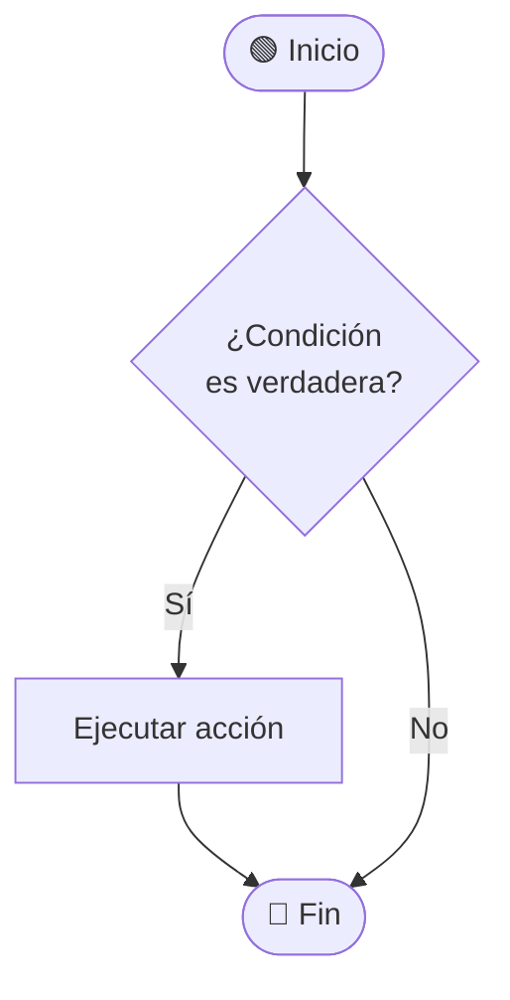

   <div align="center">

<!-- ENLACE INTERNO AL LOGO SUBIDO -->
 


# <span style="color:#003366">UNIVERSIDAD NACIONAL DE LOJA</span>

### **<span style="color:#8B6D1B">FACULTAD DE LA ENERGÍA, LAS INDUSTRIAS Y LOS RECURSOS NATURALES NO RENOVABLES</span>**
**Carrera de Ingeniería en Computación**

---

<br>

## 📓 **TEMA:** 
# <span style="color:#003366">Portafolio Digital de Aprendizaje</span>

**ASIGNATURA:** Teoría de la Programación  
**UNIDAD:** 1 | **CICLO:** 1

<br>

---

### *“<span style="color:#8B6D1B">Educamos para Transformar</span>”*

<br>

</div>

---

## DOCUMENTACION 

### **Introducción** 

Este portafolio refleja el avance en los fundamentos de la programación, enfocándose en el estudio y aplicación de las estructuras condicionales y estructuras repetitivas, tanto en su representación en diagramas de flujo como en pseudocódigo. El propósito es consolidar la capacidad de diseñar algoritmos más complejos y dinámicos, que permitan evaluar condiciones, tomar decisiones y ejecutar procesos iterativos. De esta manera, se fortalece el razonamiento lógico y se sientan las bases para la construcción de programas completos y organizados en distintos lenguajes de programación.

---
 
 ## 🧠  **Estructuras condicionales**

<details open>
  <summary><b>✨ Resolución paso a paso</b></summary>

  <div style="background-color:#1e1e1e; padding:14px; border-radius:8px; color:#E0E0E0;">
# 🔀 Estructuras Condicionales en Programación

> **Materia:** Fundamentos de Programación  
> **Tema:** Estructuras de control — Condicionales  
> **Nivel:** Primer ciclo — Ingeniería en Computación

---

## 📌 ¿Qué es una estructura condicional?

Una **estructura condicional** (también llamada estructura de selección o decisión) es un bloque de código que permite al programa **tomar decisiones** durante su ejecución. Evalúa una condición lógica y, según el resultado (`Verdadero` o `Falso`), ejecuta un camino u otro.

### ¿Por qué son importantes?

| Razón | Descripción |
|---|---|
| 🧠 **Lógica de negocio** | Permiten que el programa reaccione de forma diferente según los datos o el contexto |
| 🔁 **Control del flujo** | Sin condicionales, todos los programas ejecutarían las mismas instrucciones siempre |
| ✅ **Validación** | Se usan para verificar entradas del usuario, rangos válidos, permisos, etc. |
| ⚡ **Eficiencia** | Evitan ejecutar código innecesario al saltar bloques según la condición |
| 🏗️ **Base de algoritmos** | Son la base de búsquedas, ordenamientos, autenticación y casi toda lógica real |

---

## 📋 Tipos de estructuras condicionales

| Tipo | Cuándo usarlo |
|---|---|
| **Simple** (`Si`) | Ejecutar algo solo si se cumple una condición |
| **Doble** (`Si … Sino`) | Elegir entre dos caminos posibles |
| **Múltiple** (`Según`) | Elegir entre tres o más casos según el valor de una expresión |

---

## 1️⃣ Condicional Simple

### 📖 Definición

La estructura condicional **simple** evalúa una condición. Si el resultado es **verdadero**, ejecuta un bloque de instrucciones. Si es **falso**, simplemente lo omite y el programa continúa su flujo normal.

> Es la forma más básica de toma de decisiones: "haz esto **solo si** se cumple la condición."

### 💡 Importancia

- Permite ejecutar código **opcionalmente**, sin interrumpir el flujo general.
- Ideal para **validaciones rápidas** (ej: verificar si un número es positivo antes de procesarlo).
- Base de toda lógica de control: cualquier programa real usa decenas o cientos de condicionales simples.

### 📐 Diagrama de flujo



### 📝 Pseudocódigo

```
Inicio
    Si (condición) entonces
        acción
    Fin_Si
Fin
```

### 💻 Ejemplo práctico

**Problema:** Mostrar un mensaje si el usuario es mayor de edad.

```
Inicio
    Leer edad
    Si (edad >= 18) entonces
        Escribir "Eres mayor de edad. Acceso permitido."
    Fin_Si
Fin
```

**Traza de ejecución:**

| edad | edad >= 18 | Salida |
|---|---|---|
| 20 | Verdadero | "Eres mayor de edad. Acceso permitido." |
| 15 | Falso | _(nada)_ |

---

## 2️⃣ Condicional Doble (Si … Sino)

### 📖 Definición

La estructura condicional **doble** evalúa una condición y ofrece **dos caminos alternativos**: uno si la condición es verdadera (`Si`) y otro si es falsa (`Sino`). Siempre se ejecuta uno de los dos bloques, nunca ambos ni ninguno.

> "Si se cumple la condición, haz A; de lo contrario, haz B."

### 💡 Importancia

- Garantiza que el programa **siempre tenga una respuesta**, sin dejar casos sin atender.
- Cubre el escenario completo de una condición binaria (verdadero/falso, sí/no, par/impar).
- Es fundamental para lógicas de tipo: aprobado/reprobado, par/impar, mayor/menor, login correcto/incorrecto.
- Hace el código más **robusto y predecible**, evitando silencios inesperados.

### 📐 Diagrama de flujo


### 📝 Pseudocódigo

```
Inicio
    Si (condición) entonces
        Acción A
    Sino
        Acción B
    Fin_Si
Fin
```

### 💻 Ejemplo práctico

**Problema:** Determinar si un número es par o impar.

```
Inicio
    Leer numero
    Si (numero MOD 2 = 0) entonces
        Escribir "El número es par"
    Sino
        Escribir "El número es impar"
    Fin_Si
Fin
```

**Traza de ejecución:**

| numero | numero MOD 2 = 0 | Salida |
|---|---|---|
| 8 | Verdadero | "El número es par" |
| 7 | Falso | "El número es impar" |

---

## 3️⃣ Condicional Múltiple (Según / Switch)

### 📖 Definición

La estructura condicional **múltiple** evalúa el valor de una expresión o variable y lo compara contra **varios casos posibles**. Ejecuta el bloque correspondiente al caso que coincida. Si ningún caso coincide, ejecuta el bloque **defecto** (opcional).

> "Según el valor que tenga la variable, elige cuál de estos caminos tomar."

### 💡 Importancia

- Evita escribir largas cadenas de `Si … Sino Si … Sino Si …`, haciendo el código **más limpio y legible**.
- Muy usada en menús de opciones, días de la semana, meses, estados de un sistema, etc.
- Mejora el **mantenimiento** del código: agregar un caso nuevo es trivial, sin reestructurar todo.
- En la mayoría de lenguajes de programación (`switch`, `match`, `case`) se implementa directamente en hardware como una tabla de salto, lo que la hace **muy eficiente**.

### 📐 Diagrama de flujo


### 📝 Pseudocódigo

```
Inicio
    Según (expresión) hacer
        caso 1:
            Acción 1
        caso 2:
            Acción 2
        caso 3:
            Acción 3
        defecto:
            Acción por defecto
    Fin_Según
Fin
```

### 💻 Ejemplo práctico

**Problema:** Mostrar el nombre del día de la semana según un número del 1 al 7.

```
Inicio
    Leer dia
    Según (dia) hacer
        caso 1:  Escribir "Lunes"
        caso 2:  Escribir "Martes"
        caso 3:  Escribir "Miércoles"
        caso 4:  Escribir "Jueves"
        caso 5:  Escribir "Viernes"
        caso 6:  Escribir "Sábado"
        caso 7:  Escribir "Domingo"
        defecto: Escribir "Número inválido (debe ser 1-7)"
    Fin_Según
Fin
```

**Traza de ejecución:**

| dia | Salida |
|---|---|
| 1 | "Lunes" |
| 5 | "Viernes" |
| 9 | "Número inválido (debe ser 1-7)" |

---

## 🔗 Condicionales anidadas

Es posible colocar una estructura condicional **dentro de otra**. Esto permite evaluar condiciones más complejas.

### 📝 Pseudocódigo

```
Inicio
    Si (condición 1) entonces
        Si (condición 2) entonces
            Acción A   ← solo si ambas son verdaderas
        Sino
            Acción B   ← condición 1 verdadera, condición 2 falsa
        Fin_Si
    Sino
        Acción C       ← condición 1 falsa
    Fin_Si
Fin
```

### 💻 Ejemplo: Clasificar una nota

```
Inicio
    Leer nota
    Si (nota >= 7) entonces
        Si (nota >= 9) entonces
            Escribir "Excelente"
        Sino
            Escribir "Aprobado"
        Fin_Si
    Sino
        Escribir "Reprobado"
    Fin_Si
Fin
```

---

## 📊 Tabla comparativa

| Característica | Simple | Doble | Múltiple |
|---|:---:|:---:|:---:|
| Evalúa una condición lógica | ✅ | ✅ | — |
| Evalúa el valor de una expresión | — | — | ✅ |
| Caminos posibles | 1 | 2 | N |
| Siempre ejecuta algo | ❌ | ✅ | ✅ (si hay defecto) |
| Ideal para menús / opciones | ❌ | ❌ | ✅ |
| Ideal para validaciones simples | ✅ | ✅ | ❌ |

---

## 🧩 Símbolos del diagrama de flujo

| Símbolo | Nombre | Uso |
|---|---|---|
| Óvalo / Elipse | Terminal | Inicio y Fin del algoritmo |
| Rombo | Decisión | Representa la condición (pregunta Sí/No) |
| Rectángulo | Proceso | Acción o instrucción a ejecutar |
| Flecha | Flujo | Indica la dirección del proceso |

---

> 📚 **Nota:** Los diagramas de flujo de este documento usan sintaxis **Mermaid**, que GitHub renderiza automáticamente. Para verlos localmente, usa [Mermaid Live Editor](https://mermaid.live).


  </div>
</details>

---
 
 ## 🧠  **Estructuras condicionales**

<details open>
  <summary><b>✨ Resolución paso a paso</b></summary>

  <div style="background-color:#1e1e1e; padding:14px; border-radius:8px; color:#E0E0E0;">

mmmmm

  </div>
</details>

---

**<strong><a href="Portada.md">🏠 INICIO</a></strong>**
