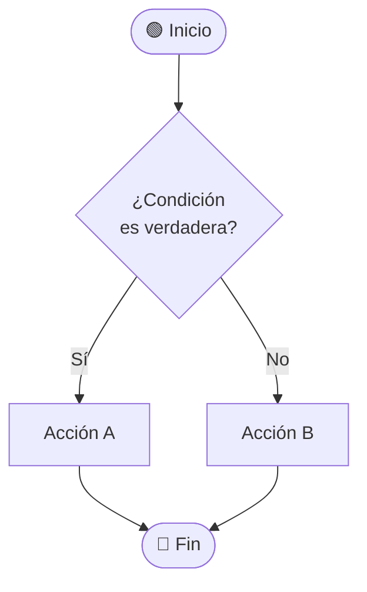
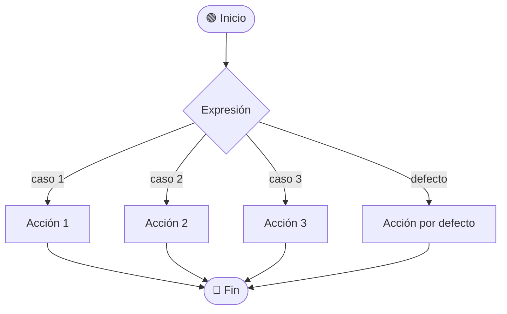
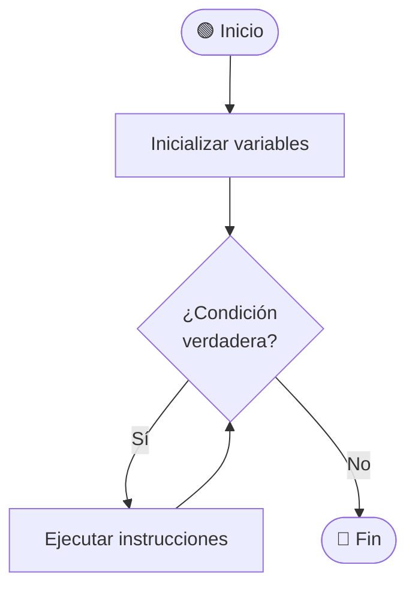
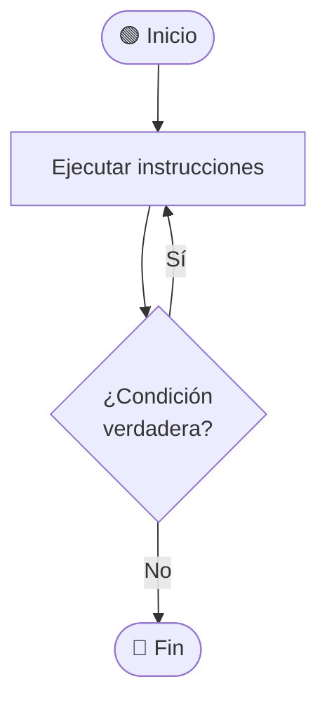
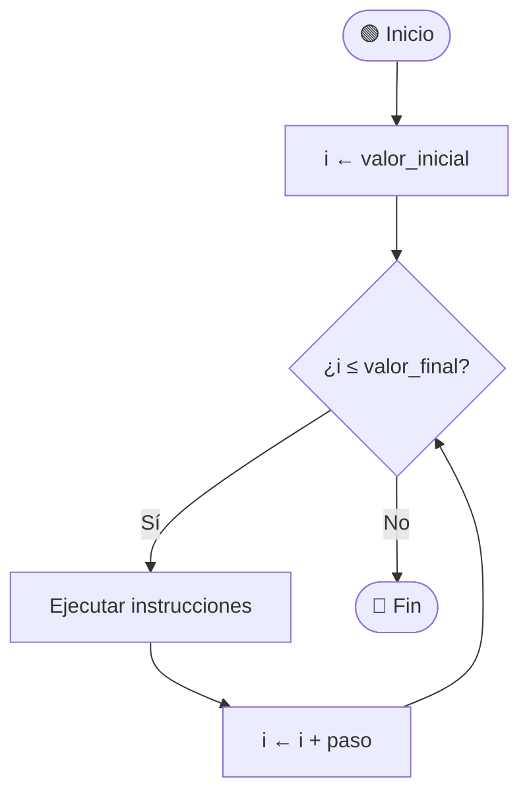

   <div align="center">

<!-- ENLACE INTERNO AL LOGO SUBIDO -->
 


# <span style="color:#003366">UNIVERSIDAD NACIONAL DE LOJA</span>

### **<span style="color:#8B6D1B">FACULTAD DE LA ENERGÍA, LAS INDUSTRIAS Y LOS RECURSOS NATURALES NO RENOVABLES</span>**
**Carrera de Ingeniería en Computación**

---

<br>

## 📓 **TEMA:** 
# <span style="color:#003366">Portafolio Digital de Aprendizaje</span>

**ASIGNATURA:** Teoría de la Programación  
**UNIDAD:** 1 | **CICLO:** 1

<br>

---

### *“<span style="color:#8B6D1B">Educamos para Transformar</span>”*

<br>

</div>

---

## DOCUMENTACION 

### **Introducción** 

Este portafolio refleja el avance en los fundamentos de la programación, enfocándose en el estudio y aplicación de las estructuras condicionales y estructuras repetitivas, tanto en su representación en diagramas de flujo como en pseudocódigo. El propósito es consolidar la capacidad de diseñar algoritmos más complejos y dinámicos, que permitan evaluar condiciones, tomar decisiones y ejecutar procesos iterativos. De esta manera, se fortalece el razonamiento lógico y se sientan las bases para la construcción de programas completos y organizados en distintos lenguajes de programación.

---
 
 ## 🧠  **Estructuras condicionales**

<details open>
  <summary><b>✨ Resolución paso a paso</b></summary>

  <div style="background-color:#1e1e1e; padding:14px; border-radius:8px; color:#E0E0E0;">
# 🔀 Estructuras Condicionales en Programación

> **Materia:** Fundamentos de Programación  
> **Tema:** Estructuras de control — Condicionales  
> **Nivel:** Primer ciclo — Ingeniería en Computación

---

## 📌 ¿Qué es una estructura condicional?

Una **estructura condicional** (también llamada estructura de selección o decisión) es un bloque de código que permite al programa **tomar decisiones** durante su ejecución. Evalúa una condición lógica y, según el resultado (`Verdadero` o `Falso`), ejecuta un camino u otro.

### ¿Por qué son importantes?

| Razón | Descripción |
|---|---|
| 🧠 **Lógica de negocio** | Permiten que el programa reaccione de forma diferente según los datos o el contexto |
| 🔁 **Control del flujo** | Sin condicionales, todos los programas ejecutarían las mismas instrucciones siempre |
| ✅ **Validación** | Se usan para verificar entradas del usuario, rangos válidos, permisos, etc. |
| ⚡ **Eficiencia** | Evitan ejecutar código innecesario al saltar bloques según la condición |
| 🏗️ **Base de algoritmos** | Son la base de búsquedas, ordenamientos, autenticación y casi toda lógica real |

---

## 📋 Tipos de estructuras condicionales

| Tipo | Cuándo usarlo |
|---|---|
| **Simple** (`Si`) | Ejecutar algo solo si se cumple una condición |
| **Doble** (`Si … Sino`) | Elegir entre dos caminos posibles |
| **Múltiple** (`Según`) | Elegir entre tres o más casos según el valor de una expresión |

---

## 1️⃣ Condicional Simple

### 📖 Definición

La estructura condicional **simple** evalúa una condición. Si el resultado es **verdadero**, ejecuta un bloque de instrucciones. Si es **falso**, simplemente lo omite y el programa continúa su flujo normal.

> Es la forma más básica de toma de decisiones: "haz esto **solo si** se cumple la condición."

### 💡 Importancia

- Permite ejecutar código **opcionalmente**, sin interrumpir el flujo general.
- Ideal para **validaciones rápidas** (ej: verificar si un número es positivo antes de procesarlo).
- Base de toda lógica de control: cualquier programa real usa decenas o cientos de condicionales simples.

### 📐 Diagrama de flujo


### 📝 Pseudocódigo

```
Inicio
    Si (condición) entonces
        acción
    Fin_Si
Fin
```

### 💻 Ejemplo práctico

**Problema:** Mostrar un mensaje si el usuario es mayor de edad.

```
Inicio
    Leer edad
    Si (edad >= 18) entonces
        Escribir "Eres mayor de edad. Acceso permitido."
    Fin_Si
Fin
```

**Traza de ejecución:**

| edad | edad >= 18 | Salida |
|---|---|---|
| 20 | Verdadero | "Eres mayor de edad. Acceso permitido." |
| 15 | Falso | _(nada)_ |

---

## 2️⃣ Condicional Doble (Si … Sino)

### 📖 Definición

La estructura condicional **doble** evalúa una condición y ofrece **dos caminos alternativos**: uno si la condición es verdadera (`Si`) y otro si es falsa (`Sino`). Siempre se ejecuta uno de los dos bloques, nunca ambos ni ninguno.

> "Si se cumple la condición, haz A; de lo contrario, haz B."

### 💡 Importancia

- Garantiza que el programa **siempre tenga una respuesta**, sin dejar casos sin atender.
- Cubre el escenario completo de una condición binaria (verdadero/falso, sí/no, par/impar).
- Es fundamental para lógicas de tipo: aprobado/reprobado, par/impar, mayor/menor, login correcto/incorrecto.
- Hace el código más **robusto y predecible**, evitando silencios inesperados.

### 📐 Diagrama de flujo



### 📝 Pseudocódigo

```
Inicio
    Si (condición) entonces
        Acción A
    Sino
        Acción B
    Fin_Si
Fin
```

### 💻 Ejemplo práctico

**Problema:** Determinar si un número es par o impar.

```
Inicio
    Leer numero
    Si (numero MOD 2 = 0) entonces
        Escribir "El número es par"
    Sino
        Escribir "El número es impar"
    Fin_Si
Fin
```

**Traza de ejecución:**

| numero | numero MOD 2 = 0 | Salida |
|---|---|---|
| 8 | Verdadero | "El número es par" |
| 7 | Falso | "El número es impar" |

---

## 3️⃣ Condicional Múltiple (Según / Switch)

### 📖 Definición

La estructura condicional **múltiple** evalúa el valor de una expresión o variable y lo compara contra **varios casos posibles**. Ejecuta el bloque correspondiente al caso que coincida. Si ningún caso coincide, ejecuta el bloque **defecto** (opcional).

> "Según el valor que tenga la variable, elige cuál de estos caminos tomar."

### 💡 Importancia

- Evita escribir largas cadenas de `Si … Sino Si … Sino Si …`, haciendo el código **más limpio y legible**.
- Muy usada en menús de opciones, días de la semana, meses, estados de un sistema, etc.
- Mejora el **mantenimiento** del código: agregar un caso nuevo es trivial, sin reestructurar todo.
- En la mayoría de lenguajes de programación (`switch`, `match`, `case`) se implementa directamente en hardware como una tabla de salto, lo que la hace **muy eficiente**.

### 📐 Diagrama de flujo



### 📝 Pseudocódigo

```
Inicio
    Según (expresión) hacer
        caso 1:
            Acción 1
        caso 2:
            Acción 2
        caso 3:
            Acción 3
        defecto:
            Acción por defecto
    Fin_Según
Fin
```

### 💻 Ejemplo práctico

**Problema:** Mostrar el nombre del día de la semana según un número del 1 al 7.

```
Inicio
    Leer dia
    Según (dia) hacer
        caso 1:  Escribir "Lunes"
        caso 2:  Escribir "Martes"
        caso 3:  Escribir "Miércoles"
        caso 4:  Escribir "Jueves"
        caso 5:  Escribir "Viernes"
        caso 6:  Escribir "Sábado"
        caso 7:  Escribir "Domingo"
        defecto: Escribir "Número inválido (debe ser 1-7)"
    Fin_Según
Fin
```

**Traza de ejecución:**

| dia | Salida |
|---|---|
| 1 | "Lunes" |
| 5 | "Viernes" |
| 9 | "Número inválido (debe ser 1-7)" |

---

## 🔗 Condicionales anidadas

Es posible colocar una estructura condicional **dentro de otra**. Esto permite evaluar condiciones más complejas.

### 📝 Pseudocódigo

```
Inicio
    Si (condición 1) entonces
        Si (condición 2) entonces
            Acción A   ← solo si ambas son verdaderas
        Sino
            Acción B   ← condición 1 verdadera, condición 2 falsa
        Fin_Si
    Sino
        Acción C       ← condición 1 falsa
    Fin_Si
Fin
```

### 💻 Ejemplo: Clasificar una nota

```
Inicio
    Leer nota
    Si (nota >= 7) entonces
        Si (nota >= 9) entonces
            Escribir "Excelente"
        Sino
            Escribir "Aprobado"
        Fin_Si
    Sino
        Escribir "Reprobado"
    Fin_Si
Fin
```

---

## 📊 Tabla comparativa

| Característica | Simple | Doble | Múltiple |
|---|:---:|:---:|:---:|
| Evalúa una condición lógica | ✅ | ✅ | — |
| Evalúa el valor de una expresión | — | — | ✅ |
| Caminos posibles | 1 | 2 | N |
| Siempre ejecuta algo | ❌ | ✅ | ✅ (si hay defecto) |
| Ideal para menús / opciones | ❌ | ❌ | ✅ |
| Ideal para validaciones simples | ✅ | ✅ | ❌ |

---

## 🧩 Símbolos del diagrama de flujo

| Símbolo | Nombre | Uso |
|---|---|---|
| Óvalo / Elipse | Terminal | Inicio y Fin del algoritmo |
| Rombo | Decisión | Representa la condición (pregunta Sí/No) |
| Rectángulo | Proceso | Acción o instrucción a ejecutar |
| Flecha | Flujo | Indica la dirección del proceso |

---

> 📚 **Nota:** Los diagramas de flujo de este documento usan sintaxis **Mermaid**, que GitHub renderiza automáticamente. Para verlos localmente, usa [Mermaid Live Editor](https://mermaid.live).


  </div>
</details>

---
 
 ## 🧠  **Estructuras repetitivas**

<details open>
  <summary><b>✨ Resolución paso a paso</b></summary>

  <div style="background-color:#1e1e1e; padding:14px; border-radius:8px; color:#E0E0E0;">

# 🔁 Estructuras Repetitivas en Programación

> **Materia:** Fundamentos de Programación  
> **Tema:** Estructuras de control — Bucles / Ciclos  
> **Nivel:** Primer ciclo — Ingeniería en Computación

---

## 📌 ¿Qué es una estructura repetitiva?

Una **estructura repetitiva** (también llamada bucle o ciclo) es un bloque de código que permite **ejecutar un conjunto de instrucciones múltiples veces**, mientras se cumpla una condición o un número determinado de veces.

Sin los bucles, para repetir 100 veces una acción habría que escribirla 100 veces. Con un bucle, basta con escribirla una sola vez.

### ¿Por qué son importantes?

| Razón | Descripción |
|---|---|
| ♻️ **Reutilización** | Evitan duplicar código: una sola instrucción se ejecuta N veces |
| 📊 **Procesamiento de datos** | Permiten recorrer listas, arreglos, archivos y colecciones completas |
| 🔢 **Automatización** | Calculan sumas, promedios, factoriales y secuencias sin intervención manual |
| 🧩 **Base de algoritmos** | Búsquedas, ordenamientos y validaciones dependen completamente de los bucles |
| 💡 **Eficiencia** | Un programa con bucles es más corto, legible y fácil de mantener |

---

## 📋 Tipos de estructuras repetitivas

| Tipo | Cuándo usarlo | Ejecuta el cuerpo si… |
|---|---|---|
| **Mientras** (`While`) | El número de repeticiones es desconocido y depende de una condición | La condición es verdadera **antes** de entrar |
| **Hacer … Mientras** (`Do-While`) | Se necesita ejecutar el cuerpo **al menos una vez** sin importar la condición | Siempre la primera vez; luego si la condición es verdadera |
| **Para** (`For`) | El número de repeticiones es conocido de antemano | El contador está dentro del rango definido |

---

## 1️⃣ Bucle Mientras (While)

### 📖 Definición

El bucle **Mientras** evalúa una condición **antes** de ejecutar el bloque de instrucciones. Si la condición es verdadera, ejecuta el cuerpo y vuelve a verificarla. Si desde el principio es falsa, el cuerpo **nunca se ejecuta**.

> "Mientras la condición sea verdadera, sigue repitiendo."

### 💡 Importancia

- Es el bucle más **general y flexible**: sirve para casi cualquier situación repetitiva.
- Útil cuando **no sabemos de antemano cuántas veces** se repetirá (ej: leer datos hasta que el usuario ingrese "salir").
- Garantiza que el cuerpo **no se ejecute** si la condición nunca fue verdadera, lo que protege el programa de errores.
- Es la base del procesamiento de **entradas del usuario**, lectura de archivos y validaciones continuas.

### ⚠️ Riesgo: bucle infinito

Si la condición nunca se vuelve falsa (porque no se modifica dentro del cuerpo), el programa se queda ejecutando para siempre. Siempre debe existir algo dentro del cuerpo que eventualmente haga falsa la condición.

### 📐 Diagrama de flujo



### 📝 Pseudocódigo

```
Inicio
    Mientras (condición) hacer
        instrucciones
    Fin_Mientras
Fin
```

### 💻 Ejemplo práctico

**Problema:** Mostrar los números del 1 al 5.

```
Inicio
    i ← 1
    Mientras (i <= 5) hacer
        Escribir i
        i ← i + 1
    Fin_Mientras
Fin
```

**Traza de ejecución:**

| i | ¿i ≤ 5? | Salida |
|---|---|---|
| 1 | Verdadero | 1 |
| 2 | Verdadero | 2 |
| 3 | Verdadero | 3 |
| 4 | Verdadero | 4 |
| 5 | Verdadero | 5 |
| 6 | Falso | _(fin del bucle)_ |

---

## 2️⃣ Bucle Hacer … Mientras (Do-While)

### 📖 Definición

El bucle **Hacer … Mientras** ejecuta el bloque de instrucciones **primero** y evalúa la condición **después**. Esto garantiza que el cuerpo del bucle se ejecute **al menos una vez**, sin importar si la condición es verdadera o falsa desde el inicio.

> "Haz las instrucciones; luego, si la condición sigue siendo verdadera, repite."

### 💡 Importancia

- Es el único bucle que **garantiza al menos una ejecución** del cuerpo, ideal cuando siempre se necesita hacer algo antes de verificar.
- Muy usado en **menús interactivos**: se muestra el menú al menos una vez, y se repite si el usuario elige continuar.
- Perfecto para **validar entradas**: pide un dato al usuario y lo valida; si es incorrecto, vuelve a pedirlo.
- Hace el código más natural en escenarios donde "primero actúas, luego decides si continúas".

### 📐 Diagrama de flujo



### 📝 Pseudocódigo

```
Inicio
    Hacer
        instrucciones
    Mientras (condición)
Fin
```

### 💻 Ejemplo práctico

**Problema:** Pedir una contraseña al usuario hasta que ingrese la correcta.

```
Inicio
    Hacer
        Escribir "Ingrese la contraseña:"
        Leer clave
    Mientras (clave ≠ "1234")
    Escribir "Acceso concedido"
Fin
```

**Traza de ejecución:**

| Intento | clave ingresada | ¿clave ≠ "1234"? | Acción |
|---|---|---|---|
| 1 | "abc" | Verdadero | Vuelve a pedir |
| 2 | "999" | Verdadero | Vuelve a pedir |
| 3 | "1234" | Falso | Sale del bucle → "Acceso concedido" |

---

## 3️⃣ Bucle Para (For)

### 📖 Definición

El bucle **Para** (o bucle de conteo) repite un bloque de instrucciones un **número exacto de veces**, controlado por una variable contadora que tiene un valor inicial, un valor final y un paso (incremento o decremento) definidos desde el inicio.

> "Repite desde el valor inicial hasta el valor final, aumentando el contador en cada vuelta."

### 💡 Importancia

- Es el más adecuado cuando se conoce **exactamente cuántas veces** debe repetirse algo.
- Muy usado para **recorrer arreglos**, listas y colecciones elemento por elemento.
- Evita errores humanos: el contador se gestiona automáticamente (inicio, condición e incremento en una sola línea).
- Hace el código **más legible y compacto** que un Mientras equivalente con contador manual.
- Fundamental en **cálculos matemáticos**: sumas de series, tablas de multiplicar, factoriales.

### 📐 Diagrama de flujo



### 📝 Pseudocódigo

```
Inicio
    Para i ← valor_inicial Hasta valor_final Con paso Hacer
        instrucciones
    Fin_Para
Fin
```

### 💻 Ejemplo práctico

**Problema:** Calcular la suma de los primeros 5 números naturales.

```
Inicio
    suma ← 0
    Para i ← 1 Hasta 5 Con paso 1 Hacer
        suma ← suma + i
    Fin_Para
    Escribir "La suma es: ", suma
Fin
```

**Traza de ejecución:**

| i | ¿i ≤ 5? | suma antes | suma después |
|---|---|---|---|
| 1 | Verdadero | 0 | 1 |
| 2 | Verdadero | 1 | 3 |
| 3 | Verdadero | 3 | 6 |
| 4 | Verdadero | 6 | 10 |
| 5 | Verdadero | 10 | 15 |
| 6 | Falso | — | _(fin)_ |

**Salida:** `La suma es: 15`

---

## 🔗 Bucles anidados

Es posible colocar un bucle **dentro de otro**. El bucle interior se ejecuta completamente en cada iteración del exterior. Se usan para trabajar con matrices, tablas y patrones.

### 📝 Pseudocódigo

```
Inicio
    Para i ← 1 Hasta 3 Con paso 1 Hacer
        Para j ← 1 Hasta 3 Con paso 1 Hacer
            Escribir i, " x ", j, " = ", i * j
        Fin_Para
    Fin_Para
Fin
```

### 💻 Salida (fragmento — tabla de multiplicar 1 al 3):

```
1 x 1 = 1    1 x 2 = 2    1 x 3 = 3
2 x 1 = 2    2 x 2 = 4    2 x 3 = 6
3 x 1 = 3    3 x 2 = 6    3 x 3 = 9
```

---

## 📊 Tabla comparativa

| Característica | Mientras | Hacer … Mientras | Para |
|---|:---:|:---:|:---:|
| Evalúa condición al inicio | ✅ | ❌ | ✅ (implícita) |
| Evalúa condición al final | ❌ | ✅ | ❌ |
| Garantiza al menos 1 ejecución | ❌ | ✅ | ❌ |
| Usa contador explícito | Opcional | Opcional | ✅ |
| Número de repeticiones conocido | No necesariamente | No necesariamente | ✅ |
| Riesgo de bucle infinito | ✅ | ✅ | Bajo |

---

## ⚠️ Conceptos clave

| Término | Definición |
|---|---|
| **Iteración** | Cada ejecución individual del cuerpo del bucle |
| **Contador** | Variable que controla cuántas veces se repite el bucle |
| **Condición de parada** | La expresión que, al volverse falsa, termina el bucle |
| **Bucle infinito** | Error en el que la condición nunca se vuelve falsa y el programa no termina |
| **Paso / Incremento** | Valor en que cambia el contador en cada iteración (puede ser negativo: decremento) |
| **Cuerpo del bucle** | Bloque de instrucciones que se repite en cada iteración |

---

## 🧩 Símbolos del diagrama de flujo

| Símbolo | Nombre | Uso |
|---|---|---|
| Óvalo / Elipse | Terminal | Inicio y Fin del algoritmo |
| Rombo | Decisión | Condición del bucle (¿se sigue repitiendo?) |
| Rectángulo | Proceso | Instrucciones del cuerpo o inicialización del contador |
| Flecha de retorno | Flujo de retorno | Indica el regreso al punto de evaluación de la condición |

---

> 📚 **Nota:** Los diagramas de flujo de este documento usan sintaxis **Mermaid**, que GitHub renderiza automáticamente. Para verlos localmente puedes usar [Mermaid Live Editor](https://mermaid.live).


  </div>
</details>

---

**<strong><a href="Portada.md">🏠 INICIO</a></strong>**
